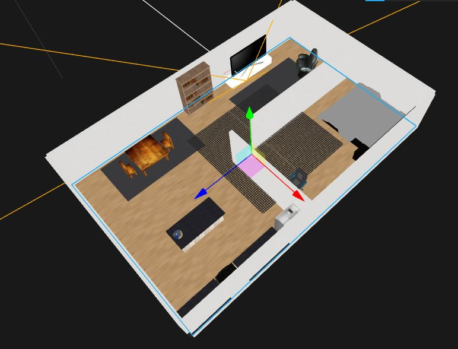
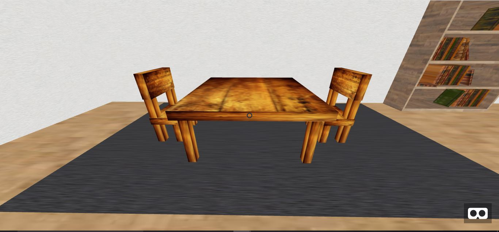
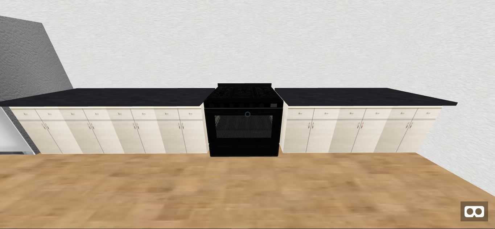
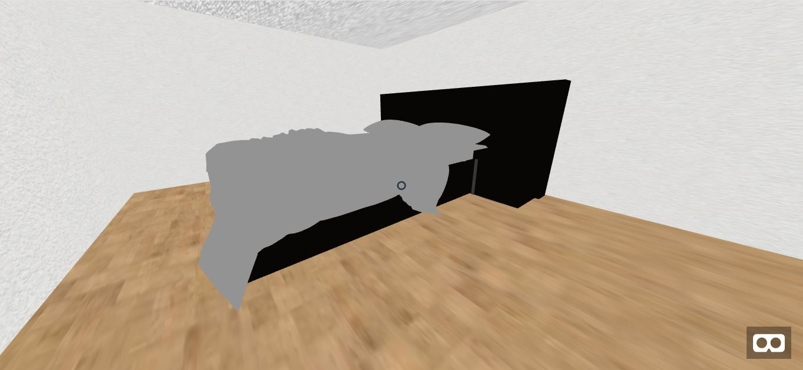
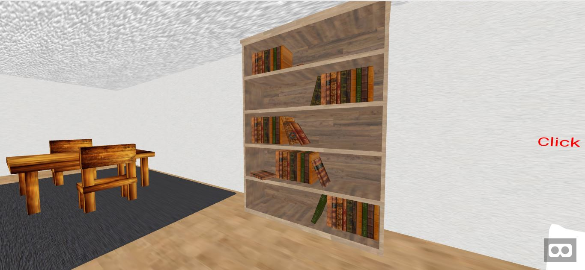
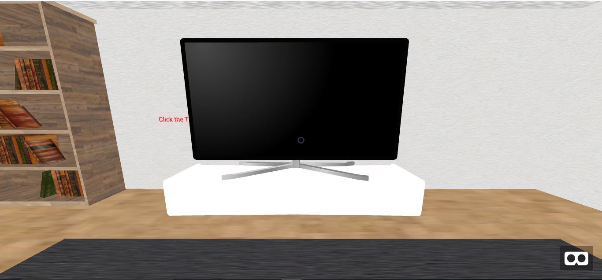
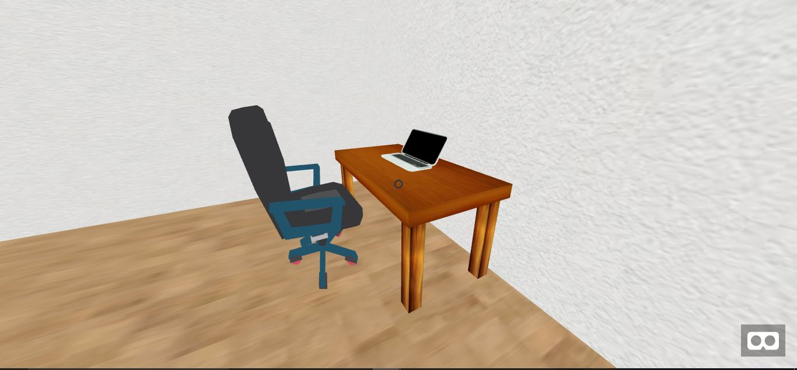
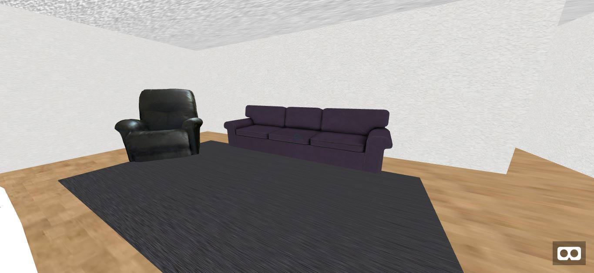
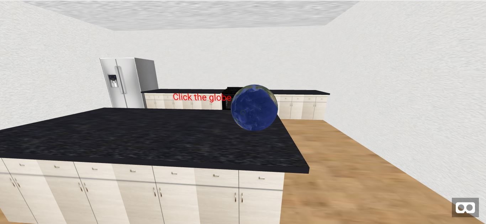

# Project-1
# CS 4331

# Short Demo Video:

https://youtu.be/w01mqrhPyck

# Live Demo link:

https://jakobdozier.github.io/Project-1/Project1/Project1.html

# Description

I created this VR space using HTML, Javascript, and A-frame.

I then made a floor to start the foundation of the house using the a-entity tag with a box shape.

After getting the foundation to the right size i then made the outside walls. To make these I used the a-entity tag and gave it the box shape with a width, depth, and height. I then made them look more realistic by adding a texture to these walls. 

I then made walls on the inside in order to make rooms inside my house. The same technique was used on these walls as the outerwalls. 

I then began to decorate the house.

The dining table and chairs were made using multiple a-entity tags and a wooden texture applied to them. And there is a box on the ground below them with carpet texture to make a rug.

The kitchen cabinets were also made with the a-entity tag with a cabinet texture applied to them. As well as a thinner box on top of them with a granite texture for the countertops. 

The rest of the models are .glft models.

 There are 20 models total and 16 unique models.
 
 11 are models made with a-frame geometry.
 
 9 are imported .gltf models.

# 3D model links

bed - https://sketchfab.com/models/96ed3f6ba55848809dfa8cd505edddae

bookshelf - https://sketchfab.com/models/b8f46cf7daca419a87ac8d131bad056f

flat_screen_tv - https://sketchfab.com/models/cc1d40351d294f6d99ee12dbd852c17c

tv_stand -https://sketchfab.com/models/fc130ca7eb6f4920afc3943e63c23ffa

gas_oven - https://sketchfab.com/models/9a4b89d7ff5c482dae835df596fdcc2f

desk_chair - https://sketchfab.com/models/3177fdf2630c4922a43fecb876d96e1d

laptop - https://sketchfab.com/models/9a960986f0cc49f99a0afdfb486ec859

recliner - https://sketchfab.com/models/90af9d39869f407e8d4e3ef9531f693e

sofa - https://sketchfab.com/models/505e808469ac4d3aa853097df67de102

# There are two interactable objects:

  The globe - which spins when clicked on.
  
  
  The television - which makes a static sound when clicked on.
  

 These are marked by red text telling the player to click on either of the objects. 
 
